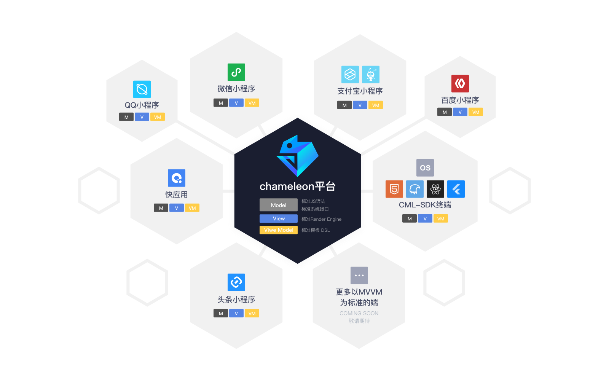
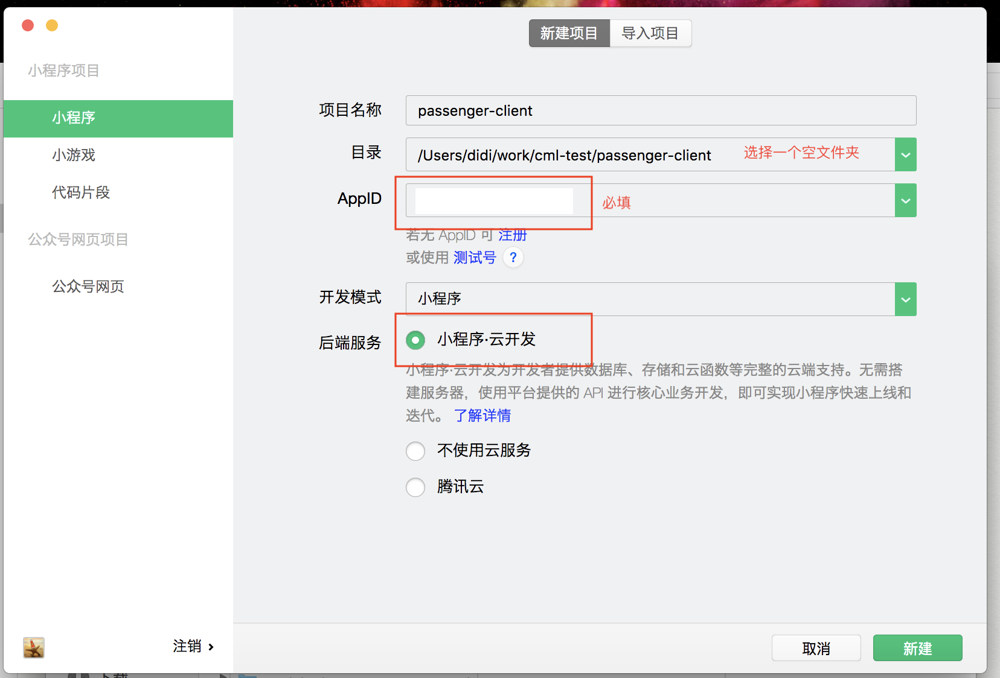
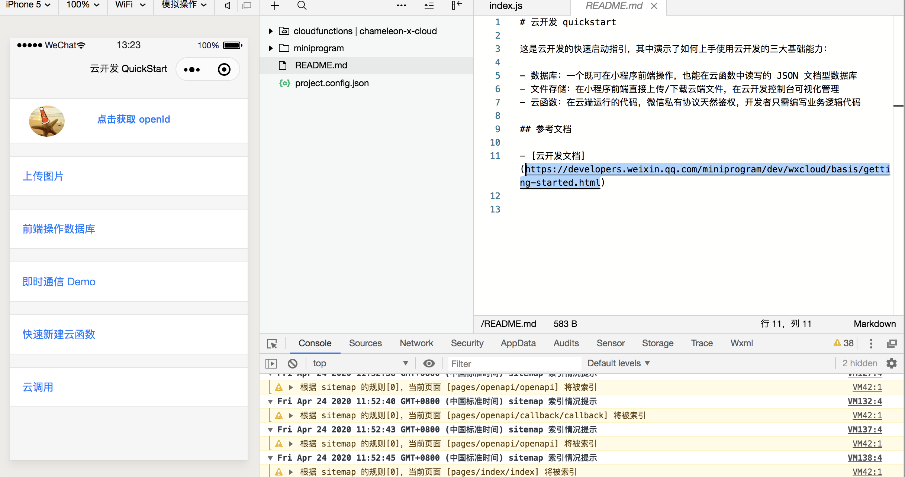

# 一步步教你使用Chameleon进行微信小程序云开发

## 0.准备工作

### 熟悉Chameleon
Chameleon致力于达到"一套代码运行多端，一端所见即多端所见"的终极目标。
目前支持平台包括：web、微信小程序、支付宝小程序、百度小程序、android(weex)、ios(weex)、qq 小程序、字节跳动小程序、快应用等



在使用Chameleon进行云开发之前，需要对其有一些基本的了解，以下是一些学习地址

* [Chameleon-github](https://github.com/didi/chameleon) 欢迎star
* [Chameleon官网](https://cmljs.org/) 欢迎体验

### 熟悉云开发

[云开发qucik-start](https://developers.weixin.qq.com/miniprogram/dev/wxcloud/basis/quickstart.html)

根据小程序云开发官方文档，首先要
* 熟悉云开发基本模板
* 开通云开发、创建环境

创建初始化模板如下


在开发者工具中预览效果大致如下



## 1.进入开发

### 1.1.全局安装最新的chameleon-tool

```
npm i chameleon-tool@1.0.5 -g
```

### 1.2.初始化一个项目
比如我们初始化一个项目名为 `cloud-demo-step` 的CML项目

```
cml init project
? please input the name of project: cloud-demo-step
✔ install success
To get started:

cd cloud-demo-step

cml dev

```

### 1.3.修改chameleon.config.js中的配置，增加`projectConfig`配置

该配置项的内容最终会生成微信小程序所需要的 `project.config.json`
* 注意需要填写正确的appid
* cloudfunctionRoot提供存放云函数的目录

为了方便大家快速学习，可以在项目中在 `chameleon.config.js`中配置 `enableLinter: false`,去掉语法检查

[云函数开发](https://developers.weixin.qq.com/miniprogram/dev/wxcloud/guide/functions/getting-started.html)
[微信小程序 project.config.json文件](https://developers.weixin.qq.com/miniprogram/dev/devtools/projectconfig.html)

### 1.4.云函数迁移

将通过微信开发者工具初始化的小程序项目《云开发 QuickStart 项目》中的`cloudfunctions/` 目录复制到 CML 初始化项目的 `src` 文件夹下

以下步骤可以详细参考，[微信小程序项目迁移到CML教程]([https://cmljs.org/docs/migrate-wx-to-cml.html#%E8%BF%81%E7%A7%BB%E5%BE%AE%E4%BF%A1%E5%B0%8F%E7%A8%8B%E5%BA%8F%E9%A1%B9%E7%9B%AE%E5%88%B0-cml](https://cmljs.org/docs/migrate-wx-to-cml.html#迁移微信小程序项目到-cml))

### 1.5.App配置迁移

#### 1.5.1.App.js 内容迁移

根据官方demo,我们只需要进行云函数的初始化即可

* 定义多态接口

在[多态接口](https://cmljs.org/docs/poly.html#%E5%A4%9A%E6%80%81%E6%8E%A5%E5%8F%A3)中，参考`component/common/cloud.interface`


```html
<script cml-type="wx">
class Method implements UtilsInterface {
  getCloud() {
    return wx.cloud;
  }
}
export default new Method();
</script>
```

* App.cml 中进行云函数的初始化

```javascript
const cloud = common.getCloud();
cloud.init({
  // env: 'your-env-id',
  traceUser: true,
})
```

#### 1.5.2.App.json 内容迁移

主要是路由的配置项的迁移，[路由配置](https://cmljs.org/docs/config.html#%E8%B7%AF%E7%94%B1%E9%85%8D%E7%BD%AE%E6%96%87%E4%BB%B6)，app.json 中的 pages 字段对应CML项目中 router.config.json 中配置

```javascript
{
  "mode": "history",
  "domain": "https://www.chameleon.com",
  "routes":[
    {
      "url": "/cml/h5/index",
      "path": "/pages/index/index",
      "name": "首页",
      "mock": "index.php"
    },
    {
      "url": "/cml/h5/user-console",
      "path": "/pages/user-console/user-console",
      "name": "用户",
      "mock": "index.php"
    },
    //.....
  ]
}
```

### 1.6. 页面、组件迁移
以 `pages/index/index` 为例，文件对应关系

| 原生小程序 | CML             |
| ---------- | --------------- |
| .wxml 文件 | template        |
| .js 文件   | script          |
| style 文件 | style           |
| json文件   | cml-type="json" |

某些基本的语法对应关系

CML的语法[参考](https://cmljs.org/docs/cml.html)

| 原生小程序 | CML        |
| ---------- | ---------- |
| wx:if      | c-if       |
| wx:for     | c-for      |
| bindtap    | c-bind:tap |

usingComponents 中对应的路径以相对路径为主。

样式文件可以直接按照 `@import 'xxxx'`进行导入；对应的样式文件直接复制到CML的项目中即可。

JS部分对应细则：

* 生命周期

| wx       | 页面生命周期/CML |
| -------- | ---------------- |
| onLoad   | 'beforeCreate',  |
| onLoad   | 'created',       |
| onLoad   | 'beforeMount',   |
| onReady  | 'mounted',       |
| onUnload | 'beforeDestroy', |
| onUnload | 'destroyed'      |

* data、props、methods

| wx    | CML     |
| ----- | ------- |
| data  | ata     |
| props | props   |
| 方法  | methods |

* API的使用

一般情况下，如果大家入门学习的话，可以直接使用`wx.xxx` 的情况，也可以尝试使用`chameleon-api`

可以在项目中在 `chameleon.config.js`中配置 `enableLinter: false`,去掉语法检查


### 1.7.全局数据的处理

对于 globalData 的处理，CML提供了store , 我们可以将这些数据放到store中

[store的使用参考](https://cmljs.org/docs/store.html)

比如首页中
```
app.globalData.openid = res.result.openid
```

迁移到CML之后
```
store.commit('getOpenId',res.result)
```

Store具体逻辑参考提供的demo源码


